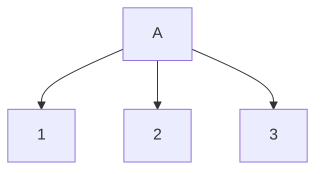
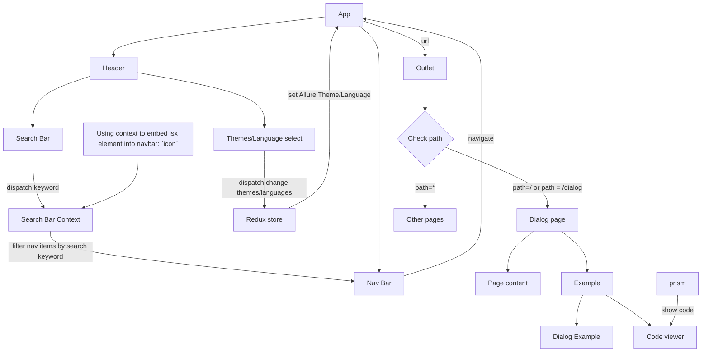

# Markdown Playground
[Markdown Syntax](https://www.markdownguide.org/cheat-sheet/)

[Mermaid Syntax](https://mermaid.js.org/intro/syntax-reference.html)

Next TODO: draw a flowchart/app system design
## General Flow of the Allure UI Clone App

